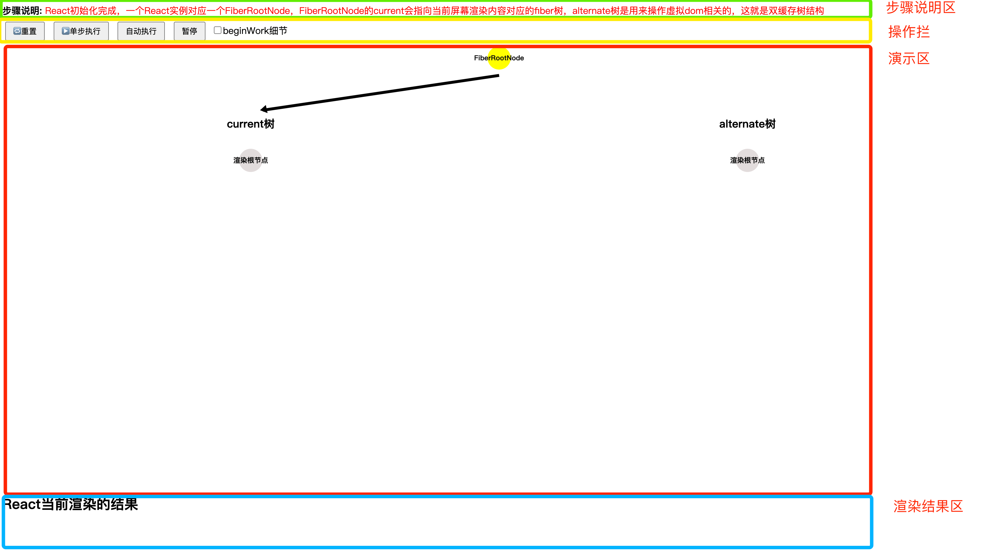
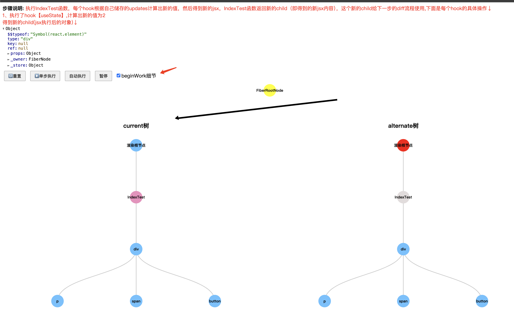

# react18-visualization
用于可视化调试React18源码的工具

使用的`React`版本：  
  "react": "^18.0.0-beta-96ca8d915-20211115",
  "react-dom": "^18.0.0-beta-96ca8d915-20211115"

`基于卡颂的react18-demo项目改造和精简`

1、 本项目不是纯新手向，是基于有看过React源码课程后（对一些专有名词有概念后），用可视化的角度去单步查看每个关键步骤，从而对React的内部运行更加了解。

2、本项目是本人学习React源码后，帮助自己总结和理清React流程的一个实践，非教程，欢迎指出问题和讨论。

3、每一个步骤的演示都是基于React原来的逻辑，为了可以单步执行每一步，只是把React同步做的事情用迭代器和回调函数改造成可中断，整体逻辑完全基于React原版。

### 目前包含的主要功能：

1. react的双缓存fiber树的结构展示
2. funtion component和hooks在render阶段的演示
3. render阶段的一些执行流程，beginWork和completeWork的展示和说明
4. 单步执行每个关键步骤,自动执行每一个步骤（默认1s）
5. 每个关键步骤的说明和该步骤关键数据的展示

## 在线预览
https://roy2017.github.io/react18-visualization/

## 使用
安装依赖

yarn

运行

npm run dev

## 目录结构说明
可视化相关代码在src/visualization文件里

src/visualization/test.jsx为React待渲染的文件

## 演示
- 功能区域介绍

- 双缓存fiber树,可以点击每个节点，查看对应的fiber对象内容

- beginWork和completeWork执行后，节点的不同颜色

- render阶段结束，commit阶段完成后，rootfiber指向新的current，渲染区渲染出真实dom节点

- 点击更新按钮发起useState更新的步骤演示

- 勾选beginWork细节，可以查看beginWork流程的一些细节

### TODO
1. 多节点diff算法的演示
2. completeWork的细节演示
3. scheduler任务调度的可视化演示
4. commit阶段的可视化演示